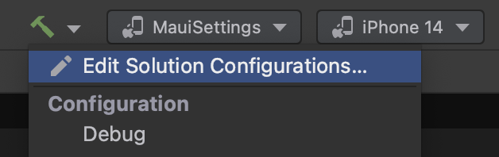
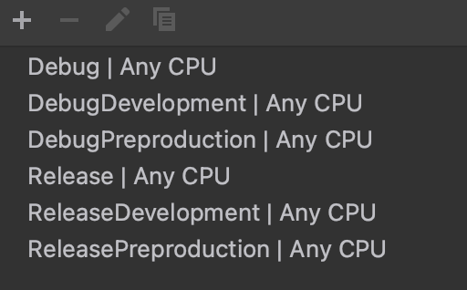
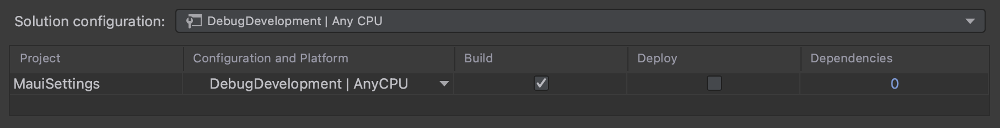
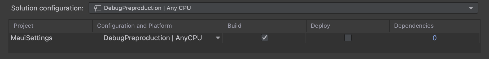
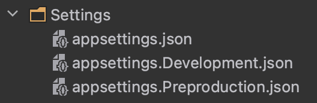
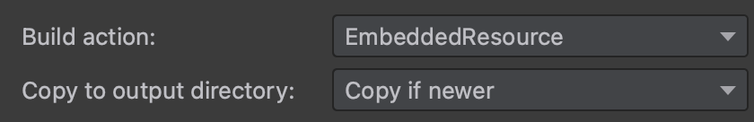

## Settings por entorno en dotNet MAUI
One of the first things I always do in my mobile applications, created with **dotNet MAUI**, is to define the environments I am going to use (for this example, development, pre-production, and production) and manage the settings of each environment with *json* files, as it is done in *asp.net.*

Below I show the steps I have followed to achieve this goal.

### 1. Create solution configurations

From the solution configuration editor, I add a configuration for each environment, for *Debug* and *Release*, so in the example, I will have 6 configurations: *DebugDevelopment, ReleaseDevelopment, DebugPreproduction, ReleasePreproduction, Debug and Release*, with *Debug* and *Release* being the ones I use as production configurations.

### 2. Create configurations in projects

In the example I am creating, I only have one project, but if I had more, I would have to repeat these steps for each of the projects, as long as they have functionalities that depend on the environment in which they are running. If not, in those projects it would not be necessary to add all the configurations, keeping *Debug* and *Release*, which are the ones created by default, would be enough.

I have created this example with *Rider*, and this IDE automatically creates the configurations in all projects when creating the solution configurations. However, from any IDE you can create them manually, you can even add them by editing the *.csproj* of each project, as will be shown below.

Once these configurations are created, the next step would be to add a constant to each of the configurations. In the example, I have added the DEVELOPMENT and PREPRODUCTION constants to their respective configurations. Note that I do not add any constants to the production configurations.

The *.csproj* of the project would look as follows.

~~~
...
<PropertyGroup>
    ...
    <Configurations>Debug;Release;DebugDevelopment;DebugPreproduction;ReleaseDevelopment;ReleasePreproduction</Configurations>
    ...
</PropertyGroup>

<PropertyGroup Condition=" '$(Configuration)' == 'DebugDevelopment' ">
  <DefineConstants>TRACE;DEVELOPMENT</DefineConstants>
</PropertyGroup>

<PropertyGroup Condition=" '$(Configuration)' == 'DebugPreproduction' ">
  <DefineConstants>TRACE;PREPRODUCTION</DefineConstants>
</PropertyGroup>

<PropertyGroup Condition=" '$(Configuration)' == 'ReleaseDevelopment' ">
  <DefineConstants>TRACE;DEVELOPMENT</DefineConstants>
</PropertyGroup>

<PropertyGroup Condition=" '$(Configuration)' == 'ReleasePreproduction' ">
  <DefineConstants>TRACE;PREPRODUCTION</DefineConstants>
</PropertyGroup>
...
~~~

Once the solution-level and project-level configurations have been created, it remains to link them. In both *Rider* and *Visual Studio*, this can be done in a simple way with a visual editor.

### 3. Create configuration json

As it is done in asp.net, I like to create a json for each environment. Continuing with the example, my project would look like the following picture shows.

In addition, in order to access these json at run time, it is important that we modify the properties of these files so their *build actions* are *EmbeddedResource* and their *copy to output directory* are *Copy if newer.*

### 4. Adding json information to the project configuration

Since the arrival of *dotNet MAUI*, we can enjoy the *MauiAppBuilder*, in which we can define sources, services and configurations, among others... In this step, we are going to add the information of the json added in the previous step to the *builder configuration*, depending on the environment we are running. To achieve this, we add the following functionality to the *MauiProgram* class.

~~~
public static class MauiProgram
{
    public static MauiApp CreateMauiApp()
    {
        var builder = MauiApp.CreateBuilder();
        builder
            .UseMauiApp<App>()
            .AddCustomConfiguration()
            ...

        return builder.Build();
    }

    private static MauiAppBuilder AddCustomConfiguration(this MauiAppBuilder builder)
    {
        var executingAssembly = Assembly.GetExecutingAssembly();
        using var stream = executingAssembly.GetManifestResourceStream(GetEnvironmentSettings());
        var configuration = new ConfigurationBuilder()
            .AddJsonStream(stream)
            .Build();
        
        builder.Configuration.AddConfiguration(configuration);
        return builder;
    }

    private static string GetEnvironmentSettings()
    {
#if DEVELOPMENT
        return "MauiSettings.Settings.appsettings.Development.json";
#elif PREPRODUCTION
        return "MauiSettings.Settings.appsettings.Preproduction.json";
#else
        return "MauiSettings.Settings.appsettings.json";
#endif
    }
}
~~~

It is important to note that, in order to add the above functionality and something we will add later, we need to add the following nugets packages to our project.
- Microsoft.Extensions.Configuration.Binder
- Microsoft.Extensions.Configuration.Json

### 5. Usar settings

The last step would be to know how to use the settings we have created. The way to do it is totally analogous to how it is done in asp.net. However, to clarify it, I will continue with the example that I have created.

Obviously, the settings files must have some information. Moreover, they should have the same structure for all environments.

The files I have used in the example are the following ones, for development, preproduction and production, respectively.

~~~
{
  "Info": {
    "Environment": "DEV",
    "Greettings": "Hello from development environment"
  }
}
~~~

~~~
{
  "Info": {
    "Environment": "PRE",
    "Greettings": "Hello from preproduction environment"
  }
}
~~~

~~~
{
  "Info": {
    "Environment": "PRO",
    "Greettings": "Hello from production environment"
  }
}
~~~

To validate that the configurations are read correctly, I have created a View in which I show 2 labels, one for each value of the configuration file.

To assign value to those labels, I receive the *IConfiguration* of the app in the constructor and access the values I am interested in.

~~~
public partial class MainPage 
{
    public MainPage(IConfiguration configuration)
    {        
        InitializeComponent();

        lbEnvironment.Text = $"Environment: {configuration.GetValue<string>("Info:Environment")}";
        lbGreetings.Text = $"Greetings: {configuration.GetValue<string>("Info:Greettings")}";
    }
}
~~~